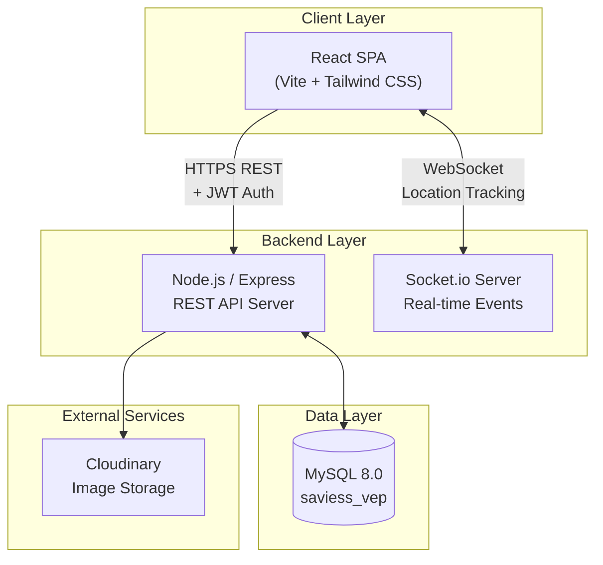
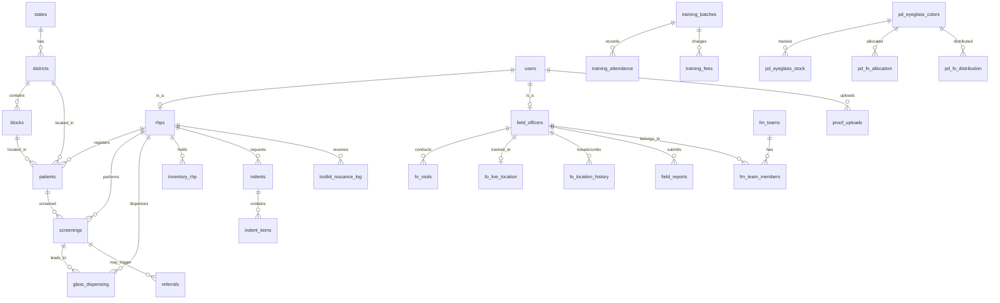
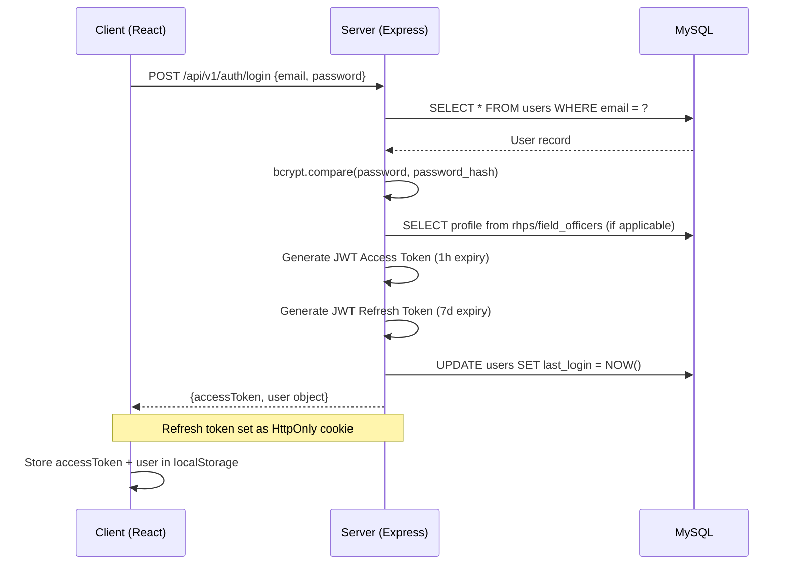
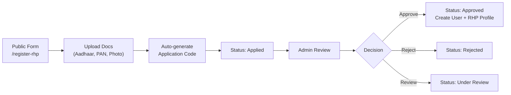
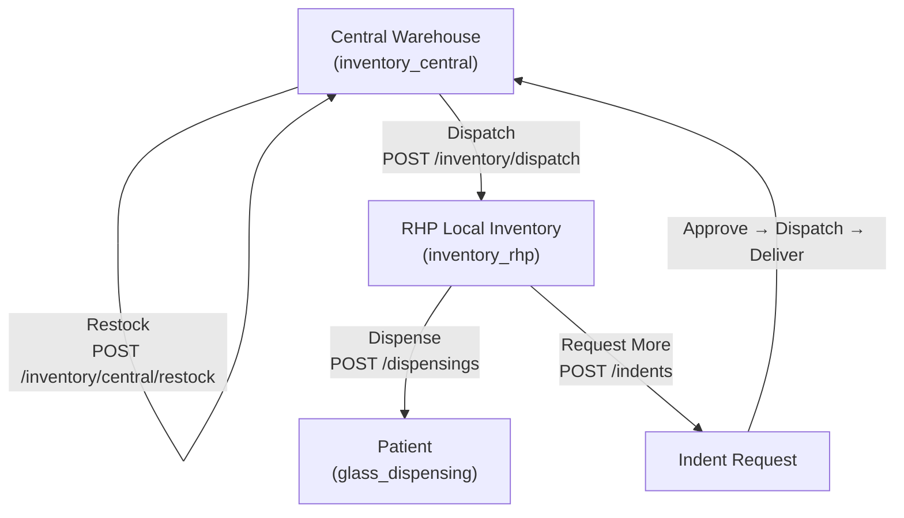
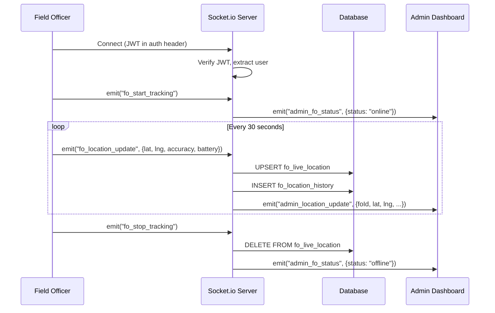
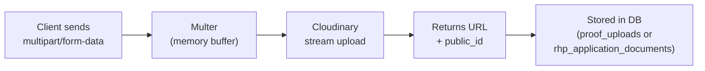
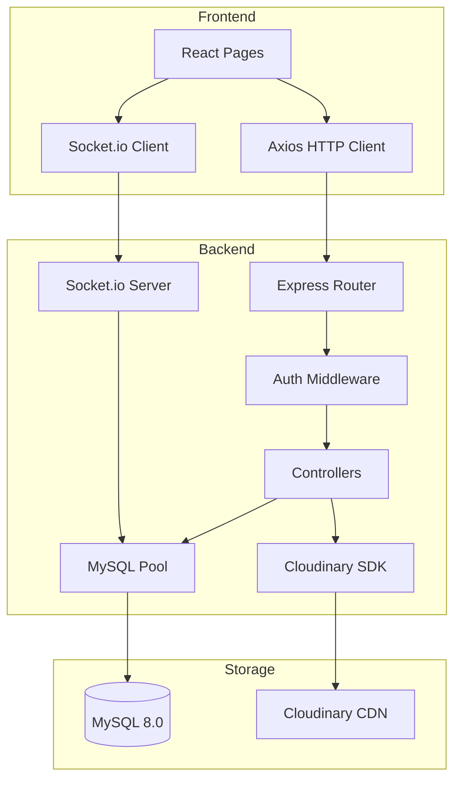
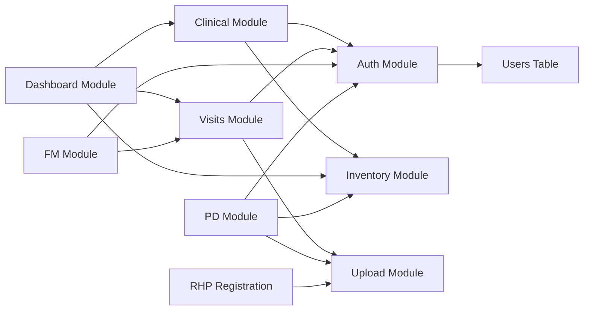

# SAVIESS Vision Entrepreneur Platform (VEP)

> **A comprehensive digital platform for managing Rural Health Providers (Vision Entrepreneurs) in Bihar, India.**
> Joint initiative by **Preheal**, **SAVIESS**, and **VisionSpring**.

---

## Table of Contents

- [1. Project Overview](#1-project-overview)
- [2. Tech Stack](#2-tech-stack)
- [3. Project Structure](#3-project-structure)
- [4. Database Documentation](#4-database-documentation)
- [5. Environment Variables](#5-environment-variables)
- [6. Authentication Flow](#6-authentication-flow)
- [7. User Roles](#7-user-roles)
- [8. Business Logic](#8-business-logic)
- [9. Inventory System](#9-inventory-system)
- [10. File Upload System](#10-file-upload-system)
- [11. API Documentation](#11-api-documentation)
- [12. Installation Guide](#12-installation-guide)
- [13. Deployment Guide](#13-deployment-guide)
- [14. Production Checklist](#14-production-checklist)
- [15. Hosting Requirements](#15-hosting-requirements)
- [16. Troubleshooting Guide](#16-troubleshooting-guide)
- [17. Future Enhancements](#17-future-enhancements)
- [18. Maintenance Notes](#18-maintenance-notes)
- [19. Deployment Commands](#19-deployment-commands)
- [20. Complete Application Context](#20-complete-application-context)

---

## 1. Project Overview

### Project Name
**SAVIESS Vision Entrepreneur Platform (VEP)**

### Purpose
A full-stack web application that digitizes the end-to-end workflow of managing Rural Health Providers (RHPs) — referred to as "Vision Entrepreneurs" — who deliver affordable eye care (screening, refraction, and spectacle dispensing) in rural Bihar, India.

### Problem It Solves
- **Manual tracking** of field operations across distributed rural locations
- **Paper-based** patient screening and spectacle dispensing records
- **No real-time visibility** into field officer movements and activities
- **Disconnected inventory** management between central warehouse and RHP centers
- **Lack of analytics** for program performance monitoring

### Target Users

| User | Description |
|------|-------------|
| **Super Admin** | Technical administrator with full system access |
| **Program Director** | Senior management overseeing multi-district operations |
| **Field Manager** | Regional manager supervising field officers |
| **Field Officer** | Ground-level coordinator visiting RHP centers |
| **RHP (Vision Entrepreneur)** | Rural health provider performing screenings and dispensing glasses |

### Key Features
- 🔐 **Role-based access control** (5 roles with granular permissions)
- 📍 **Real-time GPS tracking** of Field Officers via Socket.io + Leaflet.js maps
- 👁️ **Clinical screening & dispensing** — patient registration, refraction testing, glass dispensing with PDF receipts
- 📦 **Two-tier inventory** — central warehouse → RHP-level stock management with indent/requisition workflow
- 📊 **Analytics dashboards** — role-specific dashboards with KPIs, charts (Recharts), and data tables
- 📋 **RHP onboarding** — public registration form with document uploads (Aadhaar, PAN, certificates)
- 🗺️ **Live location maps** — admin dashboard shows real-time positions of online field officers
- 📄 **PDF generation** — bilingual (English/Hindi) dispensing receipts via PDFKit
- 👥 **Team management** — Field Managers can create teams and organize Field Officers
- 🤝 **Partner management** — Program Directors can track NGO/Govt/Corporate partnerships
- 📈 **KPI targets** — monthly district-level targets vs. actuals tracking
- 📤 **Cloud file storage** — Cloudinary integration for proof uploads and KYC documents

### High-Level Architecture



---

## 2. Tech Stack

### Frontend

| Technology | Version | Purpose |
|-----------|---------|---------|
| React | ^18.3.1 | UI component library |
| Vite | ^5.2.11 | Build tool & dev server |
| React Router DOM | ^6.23.1 | Client-side routing |
| Tailwind CSS | ^3.4.3 | Utility-first CSS framework |
| Axios | ^1.7.2 | HTTP client |
| Recharts | ^2.12.7 | Charts & data visualization |
| Leaflet | ^1.9.4 | Interactive maps |
| React-Leaflet | ^4.2.1 | React wrapper for Leaflet |
| Lucide React | ^0.395.0 | Icon library |
| Socket.io Client | ^4.7.5 | Real-time WebSocket client |

### Backend

| Technology | Version | Purpose |
|-----------|---------|---------|
| Node.js | ≥18.0.0 | JavaScript runtime |
| Express | ^4.19.2 | Web framework |
| Socket.io | ^4.7.5 | Real-time bidirectional communication |
| MySQL2 | ^3.10.0 | MySQL database driver (promise-based) |
| JSON Web Token | ^9.0.2 | Authentication tokens |
| bcrypt | ^5.1.1 | Password hashing (salt rounds: 10) |
| Multer | ^1.4.5-lts.1 | Multipart file upload handling |
| Cloudinary | ^2.2.0 | Cloud image storage SDK |
| PDFKit | ^0.19.1 | PDF document generation |
| UUID | ^9.0.1 | Unique identifier generation |
| XLSX | ^0.18.5 | Excel export generation |
| dotenv | ^16.4.5 | Environment variable management |
| Nodemon | ^3.1.2 | Development auto-restart (devDep) |
| Concurrently | ^9.0.1 | Parallel script runner (root devDep) |
| CORS | ^2.8.5 | Cross-origin resource sharing |

### Database

| Technology | Version | Purpose |
|-----------|---------|---------|
| MySQL | 8.0+ | Primary relational database |
| TiDB Cloud | Serverless | Cloud-hosted MySQL-compatible DB (production) |

### Cloud Services

| Service | Purpose |
|---------|---------|
| Cloudinary | Image/document storage and CDN delivery |
| TiDB Cloud (AWS ap-southeast-1) | Production database hosting |

---

## 3. Project Structure

```
saviess-vep/
├── package.json                  # Root monorepo config & shared scripts
├── setup.ps1                     # PowerShell one-command setup script
├── run_instructions.md           # Human-readable setup guide
│
├── architecture/                 # Design & planning documents
│   ├── system_architecture.md    # High-level system design & Socket.io schemas
│   └── api_endpoints.md          # API endpoint reference (design phase)
│
├── database/                     # SQL schema & migrations
│   ├── schema.sql                # Base schema — 23 tables, triggers
│   ├── migration_add_states.sql  # States master table + district linkage
│   ├── migration_v2.sql          # Partners, KPI targets, field reports
│   ├── migration_fm_teams.sql    # Field Manager teams & members
│   ├── migration_pd_module.sql   # PD visits, eyeglass colors/stock/distribution
│   ├── migration_rhp_registration.sql  # Extended RHP application fields
│   └── migration_rhp_cloud.sql   # Cloud-compatible RHP migration variant
│
├── backend/                      # Express.js API server
│   ├── package.json              # Backend dependencies
│   ├── .env                      # Environment variables (git-ignored)
│   ├── .env.example              # Template for environment setup
│   └── src/
│       ├── server.js             # Express + Socket.io bootstrap & event handlers
│       ├── config/
│       │   ├── db.js             # MySQL2 connection pool with TiDB SSL support
│       │   ├── seed.js           # Primary database seeder (states, users, inventory)
│       │   ├── seed_mock_data.js # Extended mock data seeder
│       │   ├── seed_remaining.js # Supplementary seed script
│       │   └── migrate_to_cloud.js  # Local → TiDB Cloud migration utility
│       ├── controllers/
│       │   ├── authController.js           # Login, register, provision, password management
│       │   ├── applicationController.js    # RHP application submission & review
│       │   ├── clinicalController.js       # Patient, screening, dispensing, PDF receipts
│       │   ├── dashboardController.js      # Analytics, summaries, admin data tables
│       │   ├── fieldManagerController.js   # FM teams, team locations, RHP visits
│       │   ├── fieldReportController.js    # Field officer report submission & review
│       │   ├── inventoryController.js      # Central + RHP inventory, toolkits, indents
│       │   ├── kpiController.js            # KPI targets & actuals
│       │   ├── partnerController.js        # Partner CRUD (NGO, govt, corporate)
│       │   ├── pdModuleController.js       # PD visits, eyeglass stock & distribution
│       │   ├── rhpRegistrationController.js # Public RHP registration with file uploads
│       │   └── visitController.js          # FO visits, live location, GPS tracking
│       ├── middleware/
│       │   └── auth.js           # JWT verification + role-based access (checkRole)
│       ├── routes/
│       │   └── api.js            # All API route definitions (single router file)
│       └── utils/
│           └── uploadHandler.js  # Multer + Cloudinary stream upload helper
│
└── frontend/                     # React SPA
    ├── package.json              # Frontend dependencies
    ├── index.html                # SPA entry point
    ├── vite.config.js            # Vite configuration
    ├── tailwind.config.js        # Tailwind CSS configuration
    ├── postcss.config.js         # PostCSS plugin config
    ├── .env.example              # Frontend env template
    └── src/
        ├── main.jsx              # React DOM render entry
        ├── App.jsx               # React Router — all route definitions
        ├── api.js                # Centralized API_BASE, API, SOCKET_URL constants
        ├── index.css             # Global styles & Tailwind directives
        ├── components/
        │   └── ProtectedRoute.jsx  # Auth guard + role-based route protection
        └── pages/
            ├── Login.jsx                    # Login page
            ├── AdminDashboard.jsx           # Super Admin dashboard (120KB+)
            ├── ProgramDirectorDashboard.jsx # PD dashboard (103KB+)
            ├── FieldManagerDashboard.jsx    # FM dashboard (89KB+)
            ├── FODashboard.jsx             # Field Officer dashboard (20KB)
            ├── RHPDashboard.jsx            # RHP dashboard (37KB)
            └── RegisterRHP.jsx             # Public RHP registration form (38KB)
```

### Directory Responsibilities

| Directory | Responsibility |
|-----------|----------------|
| `database/` | All SQL DDL statements. Schema creates the database, tables, indexes, and triggers. Migration files add features incrementally. |
| `backend/src/config/` | Database connection pool, seeder scripts, and cloud migration utilities. |
| `backend/src/controllers/` | Business logic layer. Each controller handles one functional domain. |
| `backend/src/middleware/` | Request pipeline — JWT verification and role authorization. |
| `backend/src/routes/` | Single `api.js` file maps all HTTP routes to controller methods with middleware chains. |
| `backend/src/utils/` | Shared utilities — Multer file upload config and Cloudinary streaming. |
| `frontend/src/pages/` | Full-page dashboard components. Each role has a dedicated dashboard. |
| `frontend/src/components/` | Reusable UI components — `ProtectedRoute` handles auth guards. |
| `architecture/` | Design documents for system architecture and API endpoint planning. |

---

## 4. Database Documentation

### Database Name
`saviess_vep` (local MySQL) / `test` (TiDB Cloud)

### Character Set
`utf8mb4` with `utf8mb4_unicode_ci` collation (full Unicode support including Hindi characters)

### Entity Relationship Diagram



### Complete Table Reference

#### Core Tables (schema.sql)

| # | Table | Purpose | Key Relationships |
|---|-------|---------|-------------------|
| 1 | `districts` | Master list of operational districts | FK → `states.id` |
| 2 | `blocks` | Administrative blocks within districts | FK → `districts.id` |
| 3 | `users` | Base user accounts with RBAC roles | Email + phone unique |
| 4 | `rhp_applications` | RHP candidate tracking pipeline | FK → `districts`, `blocks`, `users` |
| 5 | `rhps` | Onboarded RHP profiles | FK → `users.id` (1:1), `districts`, `blocks` |
| 6 | `field_officers` | Field Officer profiles | FK → `users.id` (1:1), manager → `users.id` |
| 7 | `proof_uploads` | Centralized file upload registry | FK → `users.id`, stores Cloudinary URLs |
| 8 | `fo_visits` | Field Officer visit logs | FK → `field_officers`, `rhps`, `proof_uploads` |
| 9 | `fo_live_location` | Latest FO GPS coordinates (1 per FO) | FK → `field_officers` (unique) |
| 10 | `fo_location_history` | FO GPS breadcrumb trail | FK → `field_officers`, BIGINT PK |
| 11 | `training_batches` | Training cohort management | Standalone with status lifecycle |
| 12 | `training_attendance` | Daily training attendance | FK → `training_batches`, `users` |
| 13 | `training_fees` | Training fee payment tracking | FK → `training_batches`, `users` |
| 14 | `patients` | Patient registry | FK → `rhps` (creator), `districts`, `blocks` |
| 15 | `screenings` | Vision screening results | FK → `patients`, `rhps` |
| 16 | `glass_dispensing` | Spectacle dispensing records | FK → `screenings`, `patients`, `rhps` |
| 17 | `inventory_central` | Central warehouse stock (by SKU) | SKU unique key |
| 18 | `inventory_rhp` | Per-RHP local stock | FK → `rhps`, unique (rhp_id, sku) |
| 19 | `toolkit_inventory` | Reusable toolkit catalog | Item + SKU unique |
| 20 | `toolkit_issuance_log` | Toolkit issue/return tracking | FK → `rhps`, `toolkit_inventory`, `users` |
| 21 | `indents` | Stock requisition orders | FK → `rhps`, `field_officers`, `users` |
| 22 | `indent_items` | Line items within indents | FK → `indents` |
| 23 | `referrals` | Hospital referral tracking | FK → `screenings`, `patients`, `rhps` |

#### Migration Tables

| # | Table | Migration File | Purpose |
|---|-------|---------------|---------|
| 24 | `states` | `migration_add_states.sql` | 36 Indian states/UTs master list |
| 25 | `partners` | `migration_v2.sql` | Partner organizations (NGO, Govt, Corporate) |
| 26 | `kpi_targets` | `migration_v2.sql` | Monthly district-level KPI goals |
| 27 | `field_reports` | `migration_v2.sql` | FO field reports with review workflow |
| 28 | `fm_teams` | `migration_fm_teams.sql` | FM team groups |
| 29 | `fm_team_members` | `migration_fm_teams.sql` | FO-to-team junction table |
| 30 | `pd_field_visits` | `migration_pd_module.sql` | PD observation visit logs |
| 31 | `pd_eyeglass_colors` | `migration_pd_module.sql` | Eyeglass frame color catalog |
| 32 | `pd_eyeglass_stock` | `migration_pd_module.sql` | Central eyeglass stock by color |
| 33 | `pd_eyeglass_stock_log` | `migration_pd_module.sql` | Stock addition audit trail |
| 34 | `pd_fo_allocation` | `migration_pd_module.sql` | Eyeglasses allocated to FOs by color |
| 35 | `pd_fo_allocation_log` | `migration_pd_module.sql` | Allocation audit trail |
| 36 | `pd_fo_distribution` | `migration_pd_module.sql` | Patient distribution records with proof |
| 37 | `rhp_application_documents` | `migration_rhp_registration.sql` | Uploaded KYC documents for RHP applications |

### Database Triggers

| Trigger | Table | Action |
|---------|-------|--------|
| `trg_after_screening_insert` | `screenings` | Increments `rhps.total_patients_screened` |
| `trg_after_dispense_insert` | `glass_dispensing` | Increments `rhps.total_glasses_dispensed` |

### Migration Execution Order

Migrations must be run in this specific order:

```
1. schema.sql                    → Creates database + 23 base tables + triggers
2. migration_add_states.sql      → States table + links districts to states
3. migration_v2.sql              → Partners, KPI targets, field reports
4. migration_fm_teams.sql        → FM team management tables
5. migration_pd_module.sql       → PD module (7 tables for eyeglass workflow)
6. migration_rhp_registration.sql → Extended RHP application fields + documents
7. migration_rhp_cloud.sql       → Cloud-compatible variant (relaxed constraints)
```

---

## 5. Environment Variables

### Backend (`backend/.env`)

```env
# ─── Server ───────────────────────────────────────────────
PORT=5000                          # Express server port
NODE_ENV=development               # development | production

# ─── Database ─────────────────────────────────────────────
DB_HOST=localhost                   # MySQL host (or TiDB Cloud gateway)
DB_PORT=3306                       # MySQL port (TiDB uses 4000)
DB_USER=root                       # Database username
DB_PASSWORD=                       # Database password (blank for local root)
DB_NAME=saviess_vep                # Database name (TiDB Cloud uses "test")
DB_SSL=false                       # Enable SSL (required for TiDB Cloud)

# ─── Authentication (REQUIRED — server won't start without these) ──
JWT_SECRET=your_jwt_secret_here           # Access token signing key
JWT_REFRESH_SECRET=your_jwt_refresh_secret_here  # Refresh token signing key

# ─── Cloudinary (REQUIRED for file uploads) ───────────────
CLOUDINARY_CLOUD_NAME=your_cloud_name     # Cloudinary cloud name
CLOUDINARY_API_KEY=your_api_key           # Cloudinary API key
CLOUDINARY_API_SECRET=your_api_secret     # Cloudinary API secret

# ─── CORS ──────────────────────────────────────────────────
CLIENT_URL=http://localhost:5173          # Frontend origin for CORS
```

### Frontend (`frontend/.env`)

```env
# Backend API URL (injected by Vite at build time)
VITE_API_URL=http://localhost:5000        # Production: https://api.yourdomain.com
```

### Variable Usage Map

| Variable | Used In | Purpose |
|----------|---------|---------|
| `PORT` | `server.js:179` | Express server listen port |
| `NODE_ENV` | `authController.js:163` | Cookie `Secure` flag in production |
| `DB_HOST` | `config/db.js:17` | MySQL connection pool host |
| `DB_PORT` | `config/db.js:21` | MySQL connection pool port |
| `DB_USER` | `config/db.js:18` | MySQL authentication username |
| `DB_PASSWORD` | `config/db.js:19` | MySQL authentication password |
| `DB_NAME` | `config/db.js:20` | Target database name |
| `DB_SSL` | `config/db.js:28` | Enable TLS for cloud databases |
| `JWT_SECRET` | `middleware/auth.js:13`, `authController.js:23`, `server.js:54` | Sign/verify access tokens |
| `JWT_REFRESH_SECRET` | `authController.js:32` | Sign refresh tokens |
| `CLOUDINARY_CLOUD_NAME` | `utils/uploadHandler.js:11` | Cloudinary SDK configuration |
| `CLOUDINARY_API_KEY` | `utils/uploadHandler.js:12` | Cloudinary authentication |
| `CLOUDINARY_API_SECRET` | `utils/uploadHandler.js:13` | Cloudinary signing |
| `CLIENT_URL` | `server.js:23,40` | CORS origin whitelist + Socket.io |
| `VITE_API_URL` | `frontend/src/api.js:11` | API base URL for Axios requests |

### Switching Between Local and Cloud Database

**Local MySQL:**
```env
DB_HOST=localhost
DB_PORT=3306
DB_USER=root
DB_PASSWORD=
DB_NAME=saviess_vep
DB_SSL=false
```

**TiDB Cloud:**
```env
DB_HOST=gateway01.ap-southeast-1.prod.aws.tidbcloud.com
DB_PORT=4000
DB_USER=<cluster_user>.root
DB_PASSWORD=<cluster_password>
DB_NAME=test
DB_SSL=true
```

---

## 6. Authentication Flow

### Login Flow



### JWT Token Structure

**Access Token** (1 hour expiry):
```json
{
  "userId": 1,
  "email": "admin@saviess.org",
  "role": "super_admin",
  "profileId": null,
  "districtId": null,
  "blockId": null,
  "firstName": "Sanjay",
  "lastName": "Prasad",
  "iat": 1780824900,
  "exp": 1780828500
}
```

**Refresh Token** (7 day expiry):
```json
{
  "userId": 1,
  "iat": 1780824900,
  "exp": 1781429700
}
```

### Password Hashing
- Algorithm: **bcrypt**
- Salt rounds: **10**
- Stored in: `users.password_hash` column (VARCHAR 255)

### Session Management
- Access tokens sent via `Authorization: Bearer <token>` header
- Refresh tokens stored as `HttpOnly`, `SameSite=Strict`, `Secure` (production) cookies
- Client stores access token in `localStorage.accessToken`
- Client stores user object in `localStorage.user`
- Token validation happens in `middleware/auth.js → verifyToken()`

### Role-Based Access Control (RBAC)
The `checkRole()` middleware accepts an array of allowed roles and returns `403 Forbidden` if the authenticated user's role is not in the list:

```javascript
// Example: Only super_admin and program_director can access
router.get('/kpis/targets', verifyToken, checkRole(['super_admin', 'program_director']), handler);
```

### User Provisioning
Admins create new accounts via `POST /api/v1/auth/provision`:
- Auto-generates email if not provided: `firstname.lastnameXXX@saviess.org`
- Auto-generates password: `Saviess@<last4digits_of_phone>`
- Creates role-specific profile (field_officers, rhps table entries) in same transaction
- For new RHPs: auto-seeds default reading glass inventory (9 standard power levels)

---

## 7. User Roles

### Super Admin (`super_admin`)

**Full system access with all permissions.**

| Capability | Details |
|-----------|---------|
| **User Management** | Create, view, deactivate any user account |
| **Dashboard** | Global analytics — all patients, screenings, dispensings, visits |
| **Data Tables** | View all records across entire platform |
| **Inventory** | Full access to central warehouse + all RHP inventories |
| **Field Managers** | View all FMs, their teams, visit history; reassign FOs |
| **Applications** | Review, approve, reject RHP applications |
| **Live Tracking** | View real-time GPS locations of all online Field Officers |
| **Partners** | Full CRUD on partner organizations |
| **KPI Targets** | Set and view monthly KPI targets |
| **Accessible Pages** | `/admin-dashboard` |

### Program Director (`program_director`)

**Strategic oversight and program management.**

| Capability | Details |
|-----------|---------|
| **Dashboard** | PD-specific summary with program-wide metrics |
| **Visits** | Log field visits with observations and improvement areas |
| **Eyeglass Inventory** | Manage eyeglass colors, stock levels by color |
| **FO Allocations** | Allocate eyeglasses to Field Officers |
| **Distributions** | View patient distribution records with proof |
| **Analytics** | Color-wise distribution analytics with charts |
| **Exports** | Export visits, inventory, distributions to Excel |
| **Partners** | Manage partner organizations (NGO, Govt, Corporate) |
| **KPI Targets** | Set monthly district-level targets |
| **RHP Applications** | Review, approve, reject applications |
| **Live Tracking** | View real-time FO locations on map |
| **Central Inventory** | View and restock central warehouse |
| **User Provisioning** | Create FO, FM, PD, and RHP accounts |
| **Accessible Pages** | `/pd-dashboard` |

### Field Manager (`field_manager`)

**Regional supervision of field officers and operations.**

| Capability | Details |
|-----------|---------|
| **Team Management** | Create/edit/delete teams, add/remove FO members |
| **FO Monitoring** | View managed FOs, their locations, and activities |
| **Live Tracking** | Real-time GPS positions of team FOs on map |
| **RHP Visits** | View visit reports from managed FOs to RHP centers |
| **Dashboard** | FM-specific summary with team metrics |
| **Applications** | Review, approve, reject RHP applications |
| **Central Inventory** | View central warehouse stock |
| **Dispatch** | Dispatch inventory to RHP centers |
| **Field Reports** | Review and approve/reject FO field reports |
| **User Provisioning** | Create FO and RHP accounts |
| **Accessible Pages** | `/fm-dashboard` |

### Field Officer (`field_officer`)

**Ground-level field operations.**

| Capability | Details |
|-----------|---------|
| **Visit Logging** | Log daily visits with GPS, photos, and notes |
| **GPS Tracking** | Start/stop real-time location broadcasting |
| **Field Reports** | Submit post-visit reports for manager review |
| **Eyeglass Distribution** | Distribute allocated eyeglasses to patients with proof |
| **Dashboard** | Personal visit history and distribution records |
| **Cannot Access** | Inventory management, user creation, analytics, applications |
| **Accessible Pages** | `/fo-dashboard` |

### RHP / Vision Entrepreneur (`rhp`)

**Clinical operations at the village level.**

| Capability | Details |
|-----------|---------|
| **Patient Registration** | Register new patients with demographics |
| **Vision Screening** | Log visual acuity, refraction parameters |
| **Glass Dispensing** | Record spectacle dispensing with pricing |
| **PDF Receipts** | Generate/download bilingual dispensing receipts |
| **Inventory** | View own center's stock levels |
| **Indent Requests** | Raise stock requisition orders to central warehouse |
| **Dashboard** | Personal screening/dispensing stats and inventory status |
| **Cannot Access** | Other users' data, admin features, live tracking |
| **Accessible Pages** | `/rhp-dashboard` |

---

## 8. Business Logic

### 8.1 RHP Public Registration Workflow



- Application code format: `RHP-YYYYMM-XXXXX` (auto-generated)
- Documents uploaded to Cloudinary, stored in `rhp_application_documents`
- Status lifecycle: `applied` → `under_review` → `interviewed` → `training_scheduled` → `approved` / `rejected`

### 8.2 User Login Flow
1. User submits email + password to `POST /api/v1/auth/login`
2. Server validates credentials via bcrypt comparison
3. If user is RHP or FO, their profile ID, district, and block are fetched
4. JWT access token (1h) + refresh token (7d cookie) are issued
5. Client stores token and redirects to role-specific dashboard

### 8.3 Team Creation (Field Manager)
1. FM creates a named team via `POST /api/v1/fm/teams`
2. FM adds FOs to the team via `POST /api/v1/fm/teams/:id/members`
3. FOs can belong to multiple teams
4. FM can view team member locations on a live map

### 8.4 Inventory Allocation Flow



### 8.5 Clinical Screening & Dispensing

1. **Patient Registration**: RHP registers patient demographics
2. **Vision Screening**: RHP logs visual acuity (left/right), spherical, cylindrical, axis values
3. **Screening Type**: Auto-categorized as `presbyopia`, `refractive_error`, `cataract_suspect`, `normal`, or `other`
4. **Referral**: If needed, RHP creates a referral to a hospital
5. **Glass Dispensing**: RHP dispenses spectacles, records frame type/color, pricing, and generates invoice
6. **Inventory Deduction**: Stock is tracked per-SKU at the RHP level
7. **PDF Receipt**: Bilingual receipt (English + Hindi) generated via PDFKit

### 8.6 Real-Time FO Tracking



### 8.7 PD Eyeglass Distribution Flow

1. **Stock Addition**: PD adds eyeglass stock by color → logged in `pd_eyeglass_stock_log`
2. **FO Allocation**: PD allocates stock to Field Officers → tracked in `pd_fo_allocation`
3. **Patient Distribution**: FO distributes to patients with mandatory proof upload → `pd_fo_distribution`
4. **Auto-Deduction**: FO allocation balance decremented on each distribution
5. **Analytics**: Dashboard shows color-wise stock levels, allocation, and distribution stats

### 8.8 Dashboard Analytics
Each dashboard aggregates different metrics:
- **Admin**: Total users, patients, screenings, dispensings, visits, inventory levels
- **PD**: Program-wide KPIs, eyeglass stock by color, distribution analytics
- **FM**: Team status, FO activity summaries, visit completion rates
- **FO**: Personal visit history, distribution records
- **RHP**: Personal screening/dispensing counts, inventory status

---

## 9. Inventory System

### Two-Tier Architecture

```
┌─────────────────────────────┐
│  CENTRAL WAREHOUSE          │  ← inventory_central table
│  (Power-wise SKU tracking)  │     SKU format: RD-SPH+1.50-CYL-0.00
│  Safety stock: 10 units     │
└─────────────┬───────────────┘
              │ Dispatch (POST /inventory/dispatch)
              ▼
┌─────────────────────────────┐
│  RHP LOCAL INVENTORY        │  ← inventory_rhp table
│  (Per-RHP, per-SKU)         │     Unique: (rhp_id, sku)
│  Safety stock: 2 units      │
└─────────────┬───────────────┘
              │ Dispense (POST /dispensings)
              ▼
┌─────────────────────────────┐
│  PATIENT                    │  ← glass_dispensing table
│  (Invoice generated)        │     Invoice: INV-YYYY-XXXXX
└─────────────────────────────┘
```

### Standard Reading Glass Powers

| Power (SPH) | SKU |
|------------|-----|
| +1.00 | `RD-SPH+1.00-CYL-0.00` |
| +1.25 | `RD-SPH+1.25-CYL-0.00` |
| +1.50 | `RD-SPH+1.50-CYL-0.00` |
| +1.75 | `RD-SPH+1.75-CYL-0.00` |
| +2.00 | `RD-SPH+2.00-CYL-0.00` |
| +2.25 | `RD-SPH+2.25-CYL-0.00` |
| +2.50 | `RD-SPH+2.50-CYL-0.00` |
| +2.75 | `RD-SPH+2.75-CYL-0.00` |
| +3.00 | `RD-SPH+3.00-CYL-0.00` |

### Indent/Requisition Lifecycle

```
draft → pending_approval → approved → dispatched → delivered
                                         ↓
                                      cancelled
```

- **Dispatch**: Decrements `inventory_central.quantity`
- **Delivery**: Increments `inventory_rhp.quantity`

### Toolkit Inventory
Separate catalog for reusable clinical equipment:
- Snellen Acuity Charts
- Trial Lens Set Cases
- Adjustable Trial Frames

Tracked via `toolkit_inventory` (catalog) and `toolkit_issuance_log` (issue/return events).

### PD Eyeglass Inventory (Color-Based)
A parallel inventory system managed by Program Directors:
- Tracked by **color** (Red, Brown, Blue) rather than optical power
- Supports stock addition, FO allocation, and patient distribution
- Full audit trail via `pd_eyeglass_stock_log` and `pd_fo_allocation_log`

---

## 10. File Upload System

### Configuration

| Setting | Value |
|---------|-------|
| **Storage Provider** | Cloudinary (cloud CDN) |
| **Upload Method** | Multer memory storage → Cloudinary stream |
| **Max File Size** | 5 MB |
| **Accepted Types** | Images (JPEG, PNG), PDFs |
| **Default Folder** | `saviess_uploads/` |

### Upload Flow



### Upload Contexts

| Context | Used By | Upload Field(s) |
|---------|---------|-----------------|
| `visit_proof` | Field Officers | Single photo per visit |
| `applicant_kyc` | RHP Registration | Photograph, Aadhaar, PAN, registration cert, supporting docs (up to 3) |
| `screening_proof` | Clinical Module | Screening evidence photos |
| `distribution_proof` | FO Distribution | Proof of eyeglass distribution |

### Security
- Files are streamed through server memory (never written to disk)
- Cloudinary credentials are validated on startup (warning if missing)
- Public IDs stored for secure deletion capability
- File size enforced at 5MB by Multer middleware

---

## 11. API Documentation

**Base URL**: `/api/v1`

All responses follow the format:
```json
// Success
{ "success": true, "data": { ... } }

// Error
{ "success": false, "error": "Error message" }
```

### 11.1 Authentication Module

| Method | Endpoint | Auth | Roles | Description |
|--------|----------|------|-------|-------------|
| `POST` | `/auth/login` | ❌ | Public | Login with email/password |
| `POST` | `/auth/register` | Conditional | First user: Public; After: Authenticated | Register new user |
| `GET` | `/auth/profile` | ✅ | Any | Get current user profile |
| `PUT` | `/auth/change-password` | ✅ | Any | Change own password |
| `POST` | `/auth/provision` | ✅ | super_admin, program_director, field_manager | Create user with full profile |

#### `POST /auth/login`
```json
// Request
{ "email": "admin@saviess.org", "password": "Saviess@2026" }

// Response (200)
{
  "success": true,
  "accessToken": "eyJhbGciOi...",
  "user": {
    "id": 1, "email": "admin@saviess.org",
    "firstName": "Sanjay", "lastName": "Prasad",
    "role": "super_admin", "phone": "+919999000001",
    "profileId": null, "districtId": null, "blockId": null
  }
}
```

#### `POST /auth/provision`
```json
// Request
{
  "firstName": "Preeti", "lastName": "Kumari",
  "phone": "+919876543210", "role": "rhp",
  "districtId": 1, "blockId": 1,
  "centerName": "Vision Center", "village": "Harnaut"
}

// Response (201)
{
  "success": true,
  "message": "RHP account provisioned successfully",
  "data": {
    "userId": 15, "email": "preeti.kumari123@saviess.org",
    "defaultPassword": "Saviess@3210",
    "profileId": 5, "type": "rhp"
  }
}
```

### 11.2 Location Lookups

| Method | Endpoint | Auth | Description |
|--------|----------|------|-------------|
| `GET` | `/districts` | ✅ | List all districts |
| `GET` | `/blocks?districtId=1` | ✅ | List blocks (optionally filtered by district) |
| `GET` | `/public/states` | ❌ | List all Indian states |
| `GET` | `/public/districts` | ❌ | List districts (public) |
| `GET` | `/public/blocks?districtId=1` | ❌ | List blocks (public) |

### 11.3 RHP Applications Module

| Method | Endpoint | Auth | Roles | Description |
|--------|----------|------|-------|-------------|
| `POST` | `/applications` | ❌ | Public | Submit RHP application |
| `GET` | `/applications` | ✅ | SA, PD, FM, FO | List applications |
| `PUT` | `/applications/:id/status` | ✅ | SA, PD, FM | Update application status |

### 11.4 Inventory Module

| Method | Endpoint | Auth | Roles | Description |
|--------|----------|------|-------|-------------|
| `GET` | `/inventory/central` | ✅ | SA, PD, FM | View central warehouse stock |
| `POST` | `/inventory/central/restock` | ✅ | SA, PD | Add stock to central warehouse |
| `POST` | `/inventory/dispatch` | ✅ | SA, PD, FM | Dispatch stock to RHP |
| `GET` | `/inventory/rhp/:rhpId` | ✅ | Any | View RHP's local inventory |
| `GET` | `/inventory/toolkits` | ✅ | SA, PD, FM | View toolkit catalog |
| `POST` | `/inventory/toolkits/restock` | ✅ | SA, PD | Add toolkits |
| `POST` | `/inventory/toolkits/issue` | ✅ | SA, PD, FM | Issue toolkit to RHP |

### 11.5 Indent Module

| Method | Endpoint | Auth | Roles | Description |
|--------|----------|------|-------|-------------|
| `POST` | `/indents` | ✅ | RHP | Create stock requisition |
| `GET` | `/indents` | ✅ | Any | List indents |
| `PUT` | `/indents/:id/status` | ✅ | SA, PD, FM | Approve/dispatch/deliver indent |

### 11.6 Clinical Module

| Method | Endpoint | Auth | Roles | Description |
|--------|----------|------|-------|-------------|
| `POST` | `/patients` | ✅ | RHP | Register patient |
| `GET` | `/patients` | ✅ | RHP | List own patients |
| `POST` | `/screenings` | ✅ | RHP | Log vision screening |
| `POST` | `/dispensings` | ✅ | RHP | Dispense glasses (auto-invoice) |
| `GET` | `/dispensings/:id/pdf` | ✅ | Any | Download dispensing PDF receipt |
| `GET` | `/rhps` | ✅ | Any | List all active RHPs |

### 11.7 Visits & Tracking Module

| Method | Endpoint | Auth | Roles | Description |
|--------|----------|------|-------|-------------|
| `GET` | `/visits` | ✅ | Any | List visits |
| `POST` | `/visits/log` | ✅ | FO | Log a visit with photo |
| `POST` | `/visits/location` | ✅ | FO | Post GPS location |
| `GET` | `/visits/live` | ✅ | SA, PD, FM | Get all live FO locations |
| `POST` | `/visits/stop-tracking` | ✅ | FO | Stop GPS broadcasting |

### 11.8 Dashboard Module

| Method | Endpoint | Auth | Roles | Description |
|--------|----------|------|-------|-------------|
| `GET` | `/dashboard/summary` | ✅ | SA, PD, FM | Global analytics summary |
| `GET` | `/dashboard/fo-daily` | ✅ | SA, PD, FM | FO daily summary |
| `GET` | `/dashboard/patients` | ✅ | SA, PD, FM | All patients data table |
| `GET` | `/dashboard/screenings` | ✅ | SA, PD, FM | All screenings data table |
| `GET` | `/dashboard/dispensings` | ✅ | SA, PD, FM | All dispensings data table |
| `GET` | `/dashboard/visits` | ✅ | SA, PD, FM | All visits data table |
| `GET` | `/dashboard/pd-summary` | ✅ | SA, PD | PD-specific dashboard data |
| `GET` | `/dashboard/fm-summary` | ✅ | SA, FM | FM-specific dashboard data |
| `GET` | `/dashboard/field-managers` | ✅ | SA | List all field managers |
| `GET` | `/dashboard/field-managers/:userId` | ✅ | SA | FM detail view |
| `GET` | `/dashboard/field-managers/:userId/visits` | ✅ | SA | FM's visit history |
| `PUT` | `/dashboard/field-managers/:userId/status` | ✅ | SA | Activate/deactivate FM |
| `PUT` | `/dashboard/field-managers/reassign-fo` | ✅ | SA | Reassign FO to different FM |

### 11.9 Partner & KPI Modules

| Method | Endpoint | Auth | Roles | Description |
|--------|----------|------|-------|-------------|
| `GET` | `/partners` | ✅ | SA, PD | List partners |
| `POST` | `/partners` | ✅ | SA, PD | Create partner |
| `PUT` | `/partners/:id` | ✅ | SA, PD | Update partner |
| `DELETE` | `/partners/:id` | ✅ | SA, PD | Delete partner |
| `GET` | `/kpis/targets` | ✅ | SA, PD | Get KPI targets |
| `POST` | `/kpis/targets` | ✅ | SA, PD | Set KPI targets |
| `GET` | `/kpis/actuals` | ✅ | SA, PD | Get actual KPI values |

### 11.10 Field Reports Module

| Method | Endpoint | Auth | Roles | Description |
|--------|----------|------|-------|-------------|
| `GET` | `/field-reports` | ✅ | SA, PD, FM, FO | List field reports |
| `POST` | `/field-reports` | ✅ | FO | Submit field report |
| `PUT` | `/field-reports/:id/review` | ✅ | SA, PD, FM | Approve/reject report |

### 11.11 RHP Registration Module

| Method | Endpoint | Auth | Roles | Description |
|--------|----------|------|-------|-------------|
| `POST` | `/rhp/register` | ❌ | Public | Submit RHP registration with documents |
| `GET` | `/rhp` | ✅ | SA, PD, FM | List all RHP applications |
| `GET` | `/rhp/export` | ✅ | SA, PD, FM | Export applications to Excel |
| `GET` | `/rhp/:id` | ✅ | SA, PD, FM | View single application |
| `PUT` | `/rhp/:id` | ✅ | SA, PD, FM | Update application |
| `DELETE` | `/rhp/:id` | ✅ | SA, PD, FM | Delete application |
| `PUT` | `/rhp/:id/status` | ✅ | SA, PD, FM | Approve/reject application |

### 11.12 Field Manager Module

| Method | Endpoint | Auth | Roles | Description |
|--------|----------|------|-------|-------------|
| `GET` | `/fm/field-officers` | ✅ | FM | List managed FOs |
| `POST` | `/fm/teams` | ✅ | FM | Create team |
| `GET` | `/fm/teams` | ✅ | FM | List teams |
| `PUT` | `/fm/teams/:id` | ✅ | FM | Update team |
| `DELETE` | `/fm/teams/:id` | ✅ | FM | Delete team |
| `POST` | `/fm/teams/:id/members` | ✅ | FM | Add FOs to team |
| `DELETE` | `/fm/teams/:id/members/:foId` | ✅ | FM | Remove FO from team |
| `GET` | `/fm/team-locations` | ✅ | FM | Get team FO locations |
| `GET` | `/fm/rhp-visits` | ✅ | FM | View RHP visit reports |

### 11.13 PD Module

| Method | Endpoint | Auth | Roles | Description |
|--------|----------|------|-------|-------------|
| `GET` | `/pd/visits` | ✅ | SA, PD | List PD field visits |
| `POST` | `/pd/visits` | ✅ | SA, PD | Create PD field visit |
| `PUT` | `/pd/visits/:id` | ✅ | SA, PD | Update visit |
| `DELETE` | `/pd/visits/:id` | ✅ | SA, PD | Soft-delete visit |
| `GET` | `/pd/visits/export` | ✅ | SA, PD | Export visits to Excel |
| `GET` | `/pd/eyeglass-colors` | ✅ | SA, PD | List eyeglass colors |
| `POST` | `/pd/eyeglass-colors` | ✅ | SA, PD | Add new color |
| `GET` | `/pd/eyeglass-stock` | ✅ | SA, PD | View stock by color |
| `POST` | `/pd/eyeglass-stock` | ✅ | SA, PD | Add stock |
| `GET` | `/pd/fo-list` | ✅ | SA, PD | List FOs for allocation |
| `GET` | `/pd/fo-allocations` | ✅ | SA, PD | View FO allocations |
| `POST` | `/pd/fo-allocations` | ✅ | SA, PD | Allocate to FO |
| `GET` | `/pd/distributions` | ✅ | SA, PD, FO | View distributions |
| `POST` | `/pd/distributions` | ✅ | SA, PD, FO | Record distribution |
| `GET` | `/pd/analytics` | ✅ | SA, PD | Analytics summary |
| `GET` | `/pd/inventory/export` | ✅ | SA, PD | Export inventory |
| `GET` | `/pd/distributions/export` | ✅ | SA, PD | Export distributions |

### 11.14 Health Check

| Method | Endpoint | Auth | Description |
|--------|----------|------|-------------|
| `GET` | `/health` | ❌ | Returns `{ status: "OK", timestamp }` |

---

## 12. Installation Guide

### Prerequisites
- **Node.js** ≥ 18.0.0
- **npm** ≥ 9.0.0
- **MySQL** 8.0+ (local) or TiDB Cloud account
- **Cloudinary** account (free tier works)
- **Git**

### Quick Start (One Command)

```powershell
# Clone the repository
git clone https://github.com/ViveKumar007/SAVIESS.git
cd SAVIESS

# Run everything with one command (Windows PowerShell)
npm run setup
```

This single command will:
1. ✅ Create the database and run all migrations
2. ✅ Install all dependencies (backend + frontend)
3. ✅ Seed the database with mock data
4. ✅ Start both servers

### Manual Setup

#### Step 1: Clone and install
```bash
git clone https://github.com/ViveKumar007/SAVIESS.git
cd SAVIESS
npm run install:all
```

#### Step 2: Configure environment
```bash
# Copy the template
cp backend/.env.example backend/.env

# Edit backend/.env with your values:
# - Set DB_PASSWORD (blank for local root without password)
# - Set JWT_SECRET and JWT_REFRESH_SECRET
# - Set Cloudinary credentials
```

#### Step 3: Set up the database

**PowerShell (Windows):**
```powershell
Get-Content database/schema.sql | mysql -u root
Get-Content database/migration_add_states.sql | mysql -u root saviess_vep
Get-Content database/migration_v2.sql | mysql -u root saviess_vep
Get-Content database/migration_fm_teams.sql | mysql -u root saviess_vep
Get-Content database/migration_pd_module.sql | mysql -u root saviess_vep
Get-Content database/migration_rhp_registration.sql | mysql -u root saviess_vep
Get-Content database/migration_rhp_cloud.sql | mysql -u root saviess_vep
```

**Bash (Linux/Mac):**
```bash
mysql -u root < database/schema.sql
mysql -u root saviess_vep < database/migration_add_states.sql
mysql -u root saviess_vep < database/migration_v2.sql
mysql -u root saviess_vep < database/migration_fm_teams.sql
mysql -u root saviess_vep < database/migration_pd_module.sql
mysql -u root saviess_vep < database/migration_rhp_registration.sql
mysql -u root saviess_vep < database/migration_rhp_cloud.sql
```

#### Step 4: Seed the database
```bash
npm run seed
```

#### Step 5: Start the application
```bash
npm run dev
```

- **Backend**: http://localhost:5000
- **Frontend**: http://localhost:5173

### Test Credentials

| Role | Email | Password |
|------|-------|----------|
| Super Admin | `admin@saviess.org` | `Saviess@2026` |
| Program Director | `pd@saviess.org` | `Saviess@2026` |
| Field Manager | `manager@saviess.org` | `Saviess@2026` |
| Field Officer | `fo@saviess.org` | `Saviess@2026` |
| RHP | `rhp@saviess.org` | `Saviess@2026` |

---

## 13. Deployment Guide

### Frontend Deployment

#### Vercel (Recommended)
```bash
# Install Vercel CLI
npm i -g vercel

# Deploy from frontend directory
cd frontend
vercel --prod
```

**Vercel Settings:**
- Framework: Vite
- Build Command: `npm run build`
- Output Directory: `dist`
- Environment Variable: `VITE_API_URL=https://your-backend-url.com`

#### Netlify
```bash
cd frontend
npm run build
# Upload the dist/ folder to Netlify
```

**Netlify `_redirects` file** (create in `frontend/public/`):
```
/*    /index.html   200
```

### Backend Deployment

#### Render
1. Connect GitHub repo
2. Set root directory to `backend`
3. Build command: `npm install`
4. Start command: `node src/server.js`
5. Add all environment variables from `.env`

#### Railway
1. Connect GitHub repo
2. Set root directory to `backend`
3. Railway auto-detects Node.js
4. Add environment variables in dashboard
5. Provision a MySQL instance or connect to TiDB Cloud

#### DigitalOcean App Platform
1. Connect GitHub repo
2. Configure as Node.js web service
3. HTTP port: `5000`
4. Add environment variables
5. Set health check path: `/health`

#### AWS (EC2/ECS)
```bash
# On EC2 instance
git clone https://github.com/ViveKumar007/SAVIESS.git
cd SAVIESS/backend
npm install --production
NODE_ENV=production node src/server.js

# Use PM2 for process management
npm install -g pm2
pm2 start src/server.js --name saviess-backend
pm2 save
pm2 startup
```

### Database Deployment

#### TiDB Cloud (Current Production)
- Cluster: TiDB Serverless (AWS ap-southeast-1)
- Connection: MySQL-compatible protocol on port 4000
- SSL: Required (`DB_SSL=true`)
- Database name: `test` (TiDB Serverless default)

#### Self-Hosted MySQL
```bash
# Install MySQL 8.0
sudo apt install mysql-server

# Create database and apply schema
mysql -u root -p < database/schema.sql
# Run all migrations in order...

# Create application user
mysql -u root -p -e "
  CREATE USER 'saviess_app'@'%' IDENTIFIED BY 'strong_password';
  GRANT ALL PRIVILEGES ON saviess_vep.* TO 'saviess_app'@'%';
  FLUSH PRIVILEGES;
"
```

---

## 14. Production Checklist

### Security
- [ ] Set strong, unique `JWT_SECRET` and `JWT_REFRESH_SECRET` (≥32 chars, random)
- [ ] Set `NODE_ENV=production` (enables secure cookies)
- [ ] Enable HTTPS/SSL termination (Nginx/Cloudflare)
- [ ] Set `CLIENT_URL` to exact production frontend domain (CORS)
- [ ] Enable `DB_SSL=true` for cloud databases
- [ ] Remove default seed credentials and change all passwords
- [ ] Validate Cloudinary credentials are production keys

### Infrastructure
- [ ] Configure reverse proxy (Nginx) for backend
- [ ] Set up SSL certificates (Let's Encrypt / Cloudflare)
- [ ] Configure domain DNS (A/CNAME records)
- [ ] Set up process manager (PM2 / systemd)
- [ ] Configure log rotation and monitoring
- [ ] Set up automated database backups

### Performance
- [ ] Build frontend for production: `cd frontend && npm run build`
- [ ] Serve frontend via CDN (Vercel/Netlify/CloudFront)
- [ ] Set MySQL `connectionLimit` appropriate to expected load
- [ ] Enable MySQL query cache and optimize indexes

### Monitoring
- [ ] Health check endpoint: `GET /health`
- [ ] Set up uptime monitoring (UptimeRobot, Better Uptime)
- [ ] Configure error logging (Winston, Sentry)
- [ ] Database monitoring and slow query alerts

---

## 15. Hosting Requirements

### Minimum System Requirements

| Resource | Development | Production |
|----------|------------|------------|
| **Node.js** | ≥18.0.0 | ≥18.0.0 (LTS recommended) |
| **npm** | ≥9.0.0 | ≥9.0.0 |
| **MySQL** | 8.0+ | 8.0+ (or TiDB Serverless) |
| **RAM** | 2 GB | 4 GB+ |
| **CPU** | 1 core | 2 cores+ |
| **Storage** | 1 GB | 10 GB+ (database growth) |

### Required Ports

| Port | Service | Notes |
|------|---------|-------|
| 5000 | Backend API + Socket.io | Configurable via `PORT` env var |
| 5173 | Frontend dev server (Vite) | Development only |
| 3306 | MySQL | Local development |
| 4000 | TiDB Cloud | Production cloud DB |

### Key Commands

| Command | Purpose |
|---------|---------|
| `npm run setup` | Full first-time setup + start (PowerShell) |
| `npm run dev` | Start backend + frontend concurrently |
| `npm run install:all` | Install backend + frontend dependencies |
| `npm run seed` | Populate database with mock data |
| `npm run db:migrate` | Run all database migrations |
| `cd frontend && npm run build` | Build production frontend bundle |
| `cd backend && npm start` | Start backend in production mode |

### Health Check

```bash
curl http://localhost:5000/health
# Response: {"status":"OK","timestamp":"2026-07-26T17:00:00.000Z"}
```

---

## 16. Troubleshooting Guide

### Database Connection Failures

**Error**: `Error: connect ECONNREFUSED 127.0.0.1:3306`
- **Cause**: MySQL server is not running
- **Fix**: Start MySQL service: `net start mysql` (Windows) / `sudo systemctl start mysql` (Linux)

**Error**: `Access denied for user 'root'@'localhost'`
- **Cause**: Wrong DB_PASSWORD in `.env`
- **Fix**: Set `DB_PASSWORD=` (blank) for local root, or set the correct password

**Error**: `Unknown database 'saviess_vep'`
- **Cause**: Schema not applied yet
- **Fix**: Run `Get-Content database/schema.sql | mysql -u root` (PowerShell)

### Migration Errors

**Error**: `Duplicate column name 'state_id'`
- **Cause**: Migration already applied (safe to ignore)
- **Fix**: This is expected on re-runs. The `npm run setup` script handles this gracefully.

**Error**: `Unknown database 'test'`
- **Cause**: `migration_rhp_cloud.sql` was using `USE test` instead of `USE saviess_vep`
- **Fix**: Already fixed — file now uses `USE saviess_vep`

### Authentication Issues

**Error**: `CRITICAL: JWT_SECRET and JWT_REFRESH_SECRET must be set`
- **Cause**: Missing JWT secrets in `.env`
- **Fix**: Add `JWT_SECRET=your_secret` and `JWT_REFRESH_SECRET=your_secret` to `backend/.env`

**Error**: `Invalid or expired token`
- **Cause**: Access token has expired (1 hour lifetime)
- **Fix**: Re-login to obtain a new token

### Port Conflicts

**Error**: `EADDRINUSE: address already in use :::5000`
- **Cause**: Another process is using port 5000
- **Fix (PowerShell)**:
  ```powershell
  Get-NetTCPConnection -LocalPort 5000 | ForEach-Object { Stop-Process -Id $_.OwningProcess -Force }
  ```
- **Fix (Linux/Mac)**:
  ```bash
  lsof -ti:5000 | xargs kill -9
  ```
- **Note**: The `setup.ps1` script auto-kills processes on ports 5000/5173/5174

### PowerShell Specific

**Error**: `The '<' operator is reserved for future use`
- **Cause**: PowerShell doesn't support `<` for input redirection
- **Fix**: Use `Get-Content file.sql | mysql ...` instead

### File Upload Issues

**Error**: `Cloudinary credentials are not configured`
- **Cause**: Missing `CLOUDINARY_*` variables in `.env`
- **Fix**: Sign up at https://cloudinary.com, get credentials, add to `backend/.env`

### CORS Issues

**Error**: `Access to XMLHttpRequest blocked by CORS policy`
- **Cause**: Frontend URL not matching `CLIENT_URL` in `.env`
- **Fix**: Set `CLIENT_URL=http://localhost:5173` (or your frontend's URL)

### Build Failures

**Error**: `Cannot find module 'xyz'`
- **Fix**: Run `npm run install:all` to reinstall all dependencies

### Seed Failures

**Error**: `Table 'saviess_vep.pd_eyeglass_colors' doesn't exist`
- **Cause**: PD module migration not applied
- **Fix**: Run `npm run db:migrate` before `npm run seed`

---

## 17. Future Enhancements

### Planned Features
- 📱 **Progressive Web App (PWA)** — offline-capable mobile experience for field workers
- 🔔 **Push Notifications** — alert managers when FOs check in/out
- 📊 **Advanced Analytics** — predictive demand forecasting for inventory
- 🌐 **Multi-language UI** — Hindi/English toggle across all dashboards
- 📍 **Geofencing** — automatic check-in when FO enters an RHP center's area
- 🔄 **Offline Sync** — queue operations when offline, sync when connected
- 📧 **Email Notifications** — automated emails for application status changes
- 🏥 **Referral Tracking** — full hospital follow-up workflow
- 📈 **Revenue Analytics** — financial dashboards for glass dispensing revenue
- 🔐 **Two-Factor Authentication (2FA)** — enhanced security for admin roles
- 📋 **Training Module UI** — frontend for training batch and attendance management
- 🗃️ **Data Export** — CSV/Excel export for all data tables
- 🤖 **WhatsApp Bot** — patient screening reminders and follow-ups

### Scalability Considerations
- **Redis**: Add Redis adapter for Socket.io horizontal scaling across multiple server instances
- **Database Sharding**: Partition tables by district/state as user base grows
- **CDN**: Serve frontend assets via CloudFront or Cloudflare
- **Queue System**: Add Bull/BullMQ for background jobs (PDF generation, email sending)
- **Rate Limiting**: Add express-rate-limit middleware to prevent API abuse
- **Caching**: Add Redis caching for frequently queried dashboards

---

## 18. Maintenance Notes

### Adding a New User Role
1. Add the new role to the `users.role` ENUM in `schema.sql`
2. Run `ALTER TABLE users MODIFY COLUMN role ENUM('super_admin', 'program_director', 'field_manager', 'field_officer', 'rhp', 'new_role') NOT NULL;`
3. Update `middleware/auth.js → checkRole()` for relevant routes
4. Add role-specific logic in `authController.js → login()` (profile fetching)
5. Create a new dashboard page in `frontend/src/pages/`
6. Add route in `frontend/src/App.jsx` with `ProtectedRoute`
7. Update `ProtectedRoute.jsx` redirect logic

### Adding a New Database Table
1. Create a new migration file: `database/migration_<feature_name>.sql`
2. Use `CREATE TABLE IF NOT EXISTS` for idempotency
3. Add proper foreign keys, indexes, and constraints
4. Add the file to `setup.ps1` and `package.json → db:migrate` script
5. Run the migration: `Get-Content database/migration_<name>.sql | mysql -u root saviess_vep`

### Adding a New API Endpoint
1. Create or update a controller in `backend/src/controllers/`
2. Add the route in `backend/src/routes/api.js` with appropriate middleware:
   ```javascript
   router.get('/new-endpoint', verifyToken, checkRole(['allowed_roles']), controller.method);
   ```
3. Document the endpoint in this README

### Creating Migrations
```sql
-- Template: database/migration_<feature>.sql
USE saviess_vep;
SET FOREIGN_KEY_CHECKS = 0;

-- Your DDL statements here
CREATE TABLE IF NOT EXISTS new_table (...);
ALTER TABLE existing_table ADD COLUMN new_col TYPE;

SET FOREIGN_KEY_CHECKS = 1;
```

### Deploying Updates
```bash
# Pull latest code
git pull origin main

# Install any new dependencies
npm run install:all

# Run any new migrations
npm run db:migrate

# Restart servers
# Development:
npm run dev

# Production (PM2):
pm2 restart saviess-backend
```

### Backup and Restore

```bash
# Backup
mysqldump -u root saviess_vep > backup_$(date +%Y%m%d_%H%M%S).sql

# Restore
mysql -u root saviess_vep < backup_20260726_120000.sql
```

---

## 19. Deployment Commands

### Complete Deployment from Scratch

```bash
# 1. Clone
git clone https://github.com/ViveKumar007/SAVIESS.git
cd SAVIESS

# 2. Install all dependencies
npm install
npm run install:all

# 3. Configure environment
cp backend/.env.example backend/.env
# Edit backend/.env with production values

# 4. Run database migrations
npm run db:migrate

# 5. Seed initial data
npm run seed

# 6. Build frontend for production
cd frontend && npm run build && cd ..

# 7. Start backend in production
cd backend
NODE_ENV=production node src/server.js

# OR with PM2:
pm2 start src/server.js --name saviess-backend --env production
pm2 save
```

### Docker (If Available)

```dockerfile
# Dockerfile example for backend
FROM node:18-alpine
WORKDIR /app
COPY backend/package*.json ./
RUN npm install --production
COPY backend/src ./src
EXPOSE 5000
CMD ["node", "src/server.js"]
```

---

## 20. Complete Application Context

### Overall Architecture
The SAVIESS VEP is a **monorepo** containing a React SPA frontend and an Express.js REST API backend. The frontend communicates with the backend via HTTP (Axios) for data operations and WebSocket (Socket.io) for real-time features. All data is persisted in MySQL, and files are stored in Cloudinary.

### Request Lifecycle

```
Client Request → Vite Dev Server (proxy) → Express Server
  → CORS Middleware
  → JSON Body Parser
  → Route Matching (/api/v1/*)
  → verifyToken (JWT validation)
  → checkRole (RBAC authorization)
  → Controller (business logic)
  → MySQL Query (via mysql2 pool)
  → JSON Response
```

### Data Flow



### Module Dependencies



### Important Configuration Files

| File | Purpose |
|------|---------|
| `backend/.env` | All secrets and database configuration |
| `backend/src/config/db.js` | MySQL connection pool with SSL, sql_mode, and health check |
| `backend/src/middleware/auth.js` | JWT verification and RBAC enforcement |
| `backend/src/utils/uploadHandler.js` | Multer + Cloudinary configuration |
| `frontend/src/api.js` | API_BASE, API, and SOCKET_URL constants |
| `frontend/vite.config.js` | Vite build and dev server configuration |
| `frontend/tailwind.config.js` | Tailwind CSS theme configuration |

### External Service Dependencies

| Service | Purpose | Required? |
|---------|---------|-----------|
| **MySQL 8.0** | Primary database | ✅ Yes |
| **Cloudinary** | Image/document storage | ✅ Yes (for file uploads) |
| **TiDB Cloud** | Production database | ❌ Optional (alternative to local MySQL) |

### Security Architecture
- **Authentication**: JWT-based (access + refresh tokens)
- **Password Storage**: bcrypt with 10 salt rounds
- **Authorization**: Role-based middleware on every protected route
- **CORS**: Restricted to `CLIENT_URL` origin
- **File Security**: Multer memory-only storage (no disk writes), 5MB limit
- **Database**: Parameterized queries via mysql2 (SQL injection prevention)
- **Cookie Security**: HttpOnly, SameSite=Strict, Secure (production)
- **Input Validation**: Server-side field validation in controllers
- **Foreign Key Constraints**: Referential integrity enforced at database level

---

## License

This project is private and proprietary to SAVIESS, Preheal, and VisionSpring.

---

*This document serves as the single source of truth for the SAVIESS Vision Entrepreneur Platform. Last updated: July 2026.*
